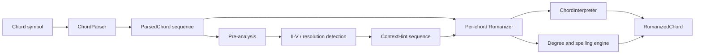

# chord_romanizer 現行設計と Rust 移植設計

## 1. この文書の目的

この文書は、Python 版 `chord_romanizer` 0.1.9 の実装とテストから、現在の仕様を逆算して整理したものである。後半では、現行挙動を検証可能な形で Rust に移植するための構成と手順を定義する。

現行挙動の正本は次の順とする。

1. `tests/` の自動テスト
2. `chord_romanizer/` の実装
3. `README.md` の説明

`build/` と `dist/` は生成物なので、移植元の正本にはしない。分析時点では Python の自動テスト 60 件がすべて成功している。

## 2. システムの目的と範囲

このライブラリは、コードシンボルとメジャーキーの主音を入力し、コードのルートおよびベースをローマ数字の度数に変換する。単純な度数変換に加え、次の処理を行う。

- 異名同音を含む音名の解析と、文脈に応じた `#` / `b` の選択
- スラッシュコードの転回形・非コードトーンベース・ハイブリッドコードの判定
- augmented triad over bass、`9sus4`、`7sus4(b9)` などの限定的な機能解釈
- II–V、完全5度解決、半音解決の検出
- 読みにくいダブルシャープ／ダブルフラットの出力上の簡略化
- 進行中のコードごとのキー指定

重要な境界として、これは完全な和声解析器ではない。たとえば C major 上の `A7` は `V7/II` ではなく基本的に `VI7` となる。現在の `roman` は「メジャースケール基準のクロマチックな度数 + 入力 quality」が中心であり、機能解釈は一部のハイブリッドコードと進行メタデータに限定される。

互換APIの`roman`表示は引き続きメジャースケール基準である。一方、高水準の
`analyze_keys_and_functions`はmajor/minorのglobal key推定、局所tonicization、
終止で確認した転調区間を別軸で返す。転調・ピボットの詳細は
[`MODULATION.md`](MODULATION.md)を参照する。

## 3. 現行の外部 API

### 3.1 パース

```python
parsed = ChordParser.parse("C#m7/G#")
```

戻り値は `Optional[ParsedChord]` である。

```text
ParsedChord
├── symbol: str          入力を trim した文字列
├── root: str            入力の異名同音表記を保持したルート
├── quality: str         ルートと slash bass 以外の未解析文字列
└── bass: Optional[str]  slash bass の音名
```

概念上の入力文法は次のとおりである。

```ebnf
chord       = no_chord | note, quality, ["/", note] ;
no_chord    = "NC" | "N.C." | "NO CHORD" ;
note        = letter, { accidental } ;
letter      = "A" | "B" | "C" | "D" | "E" | "F" | "G" | "H" ;
accidental  = "#" | "b" | "B" | "x" | "X" ;
quality     = { any character except the slash used as bass separator } ;
```

実際には quality の構文解析はせず、文字列をそのまま保存する。したがって未知の quality もパース自体は成功する。`/` が複数ある場合は、最初の `/` より後ろ全体を単一のベース音として検証するため失敗する。

`N.C.` 系は `ParsedChord(root="NC")` として返されるが、Romanizer の結果からは除外される。

### 3.2 ローマ数字化

```python
romanizer = Romanizer(default_tonic="C", simplify_accidentals=False)
results = romanizer.annotate_progression(chords)
```

入力要素には次の2形式を混在できる。

- `ParsedChord`: `default_tonic` を使う
- `(ParsedChord, tonic)`: そのコードだけ指定 tonic を使う

戻り値は `List[RomanizedChord]` である。

| フィールド | 意味 |
| --- | --- |
| `chord` | 元の `ParsedChord` |
| `roman` | quality と必要なら slash bass を含む主ラベル。例: `IIm7`, `III/#V` |
| `alternate_labels` | 異名同音の代替度数。`Python019`のみslash bassを省いた互換ラベルも含む |
| `degree_root` | quality を含まないルート度数。例: `#IV` |
| `degree_bass` | 綴りを確定したベースの度数 |
| `roman_root_bass` | quality を含まない `degree_root/degree_bass` |
| `is_hybrid` | slash bass が、推定されたコード構成音に含まれないか |
| `alter` | 認識できたハイブリッドコードの機能的な別解釈をローマ数字化したもの |
| `symbol_fixed` | キーと文脈に合わせてルート／ベースの綴りを修正したコードシンボル |
| `is_ii_v_start` | ローカル II–V の II と判定されたか |
| `is_resolution_target` | 直前のドミナントの解決先と判定されたか |
| `resolution_type` | `perfect`, `semitone`, または `None` |

Roman numerals は常に大文字で、minor は小文字ローマ数字ではなく `m` suffix で表す。`maj7` と `ma7` だけは表示時に `M7` へ正規化する。

## 4. 現行アーキテクチャ



### 4.1 モジュール責務

| Python モジュール | 現在の責務 |
| --- | --- |
| `chord_parser.py` | コード文字列の分割、音名の pitch-class 正規化、入力表記の保持 |
| `note_speller.py` | 音名と pitch class の相互変換、半音距離、ダイアトニック文字を保った綴り生成 |
| `chord_structure.py` | quality から構成音を推定する静的規則、転回形判定、quality の機能分類 |
| `chord_interpreter.py` | 非転回形 slash chord のハイブリッド解釈と候補スコアリング |
| `romanizer.py` | 進行全体の文脈解析、度数名決定、スペリング統合、結果生成 |
| `__init__.py` | 公開 API の再 export |

### 4.2 処理フェーズ

`annotate_progression` は概ね次の2パスで処理する。

1. 全体文脈パス
   - slash chord を次コードなしで仮解釈する
   - 機能上の `effective_root` と `effective_quality` を決める
   - II–V とドミナント解決を検出する
   - 半音進行や解決先から `prefer_sharps` を決める
2. コード単位の出力パス
   - ルート度数と異名同音 alternate を決める
   - 次コードを現在のキーに合わせて一時的にリスペルする
   - slash chord を文脈付きで再解釈する
   - ルート、ベース、`symbol_fixed`、`alter` を生成する
   - 全体文脈パスのメタデータを結果へコピーする

処理時間はコード数を n とすると原則 O(n)、保持メモリも O(n) である。

## 5. 音名と度数の規則

### 5.1 二層の音表現

現行実装は、同じ音に対して次の2種類の表現を使い分ける。

- pitch class: 0–11。比較や半音距離に使用する
- spelled note: `F#`, `Gb`, `Bbb` など。度数の文字と出力表記に使用する

`normalize_note_pc` は任意個の `#`, `b`, `x` を pitch class に畳み込み、内部比較用の sharp 系音名へ変換する。一方、`NoteSpeller.parse_note` と `spell_pitch_class` は音名の文字を保持して、ダブル accidental を含む理論上の綴りを生成する。

### 5.2 度数計算

基準は major scale の半音列 `[0, 2, 4, 5, 7, 9, 11]` と `I`–`VII` である。

通常は、入力 pitch class に最も近い major-scale degree を選び、差分を accidental にする。同距離の候補が2つある場合は `prefer_sharps` で決め、指定がなければ flat 側を優先する。

例（key=C）:

| pitch class 距離 | デフォルト | sharp 優先 | 代表的 alternate |
| ---: | --- | --- | --- |
| 1 | `bII` | `#I` | 相互に alternate |
| 3 | `bIII` | `#II` | 相互に alternate |
| 6 | 原則 `#IV` | `#IV` | `bV` |
| 8 | `bVI` | `#V` | 相互に alternate |
| 10 | `bVII` | `#VI` | 相互に alternate |

距離6の tritone だけは独自規則を持つ。

- diminished / half-diminished は `#IV` を優先
- 次が IV なら `bV` を優先
- ベースが `bIII`, `bVI`, `bVII` 系なら `bV` を優先
- major 7th や通常の minor 7th 系は概ね `bV` を優先
- それ以外は文脈 preference、未指定なら `#IV`

さらに、ルート距離11かつベース距離1では、`VII/bII` の増6度的な綴りを避けるため `bI/bII` を優先する。

### 5.3 文脈による accidental preference

現在コードから次コードへのルート移動で次を設定する。

- 半音上行: diminished 系なら sharp、それ以外は flat
- 半音下行: flat
- II–V–target: target の調号傾向で II の preference を上書き
- dominant–target の完全5度解決: target の調号傾向で dominant の preference を上書き

target 自体に `b` / `#` があればそれを最優先する。自然音では F を flat 系、G/D/A/E/B を sharp 系、C を中立として扱う。

### 5.4 `symbol_fixed`

選ばれた degree から、tonic の文字を基準に正しい spelled note を逆算し、元シンボルのルートとベースだけを置き換える。quality は入力文字列を保持する。

`simplify_accidentals=True` の場合は、`##` または `bb` 以上を含む出力音名だけを単純な異名同音へ変換する。degree と `roman` は変えない。

## 6. コード構造と slash chord 解釈

### 6.1 quality の構造推定

quality は完全にはパースされず、case-sensitive / case-insensitive な部分文字列規則で構成音を推定する。

| 判定例 | pitch-class interval set |
| --- | --- |
| `M7`, `maj7`, `ma7` | `{0, 4, 7, 11}` |
| `m7-5`, `m7b5` | `{0, 3, 6, 10}` |
| `dim`, `o` | `{0, 3, 6}` |
| `m7` | `{0, 3, 7, 10}` |
| その他の `7` | `{0, 4, 7, 10}` |
| その他の `m` | `{0, 3, 7}` |
| 未知または空 | `{0, 4, 7}` |

転回形判定は、slash bass の pitch class がこの interval set に含まれるかだけを見る。octave や voice position は扱わない。

### 6.2 ハイブリッド判定

slash bass が推定構成音なら通常の転回形であり、`is_hybrid=False` となる。それ以外の slash chord は、具体的な別解釈が見つからなくても `is_hybrid=True` となる。

通常の非転回形 slash chord では、bass から見た構成音に3度がなく、次の集合を含む場合に解釈を付ける。

| 必須 interval | 解釈例 | `HybridKind` |
| --- | --- | --- |
| `{2, 5, 10}` | `F/G` → `G9sus4` | `SUS4_9` |
| `{1, 5, 10}` | `Fm/G` → `G7sus4(b9)` | `SUS4_7_B9` |

augmented triad over bass がbass基準で正確に`{0,2,6,10}`となる場合はBlackadderとして検出する。解釈は`HybridKind`一個へ集約せず、`BlackadderInterpretation`の三軸に分ける。

- structure: upper augmented、dominant ninth omit3/5、half-diminished add9 omit3、aug7第三転回、whole-tone部分集合、増六、rootless dominant
- function: dominant、secondary dominant、tritone substitute、backdoor dominant、SDm、predominant
- origin: independent upper structure、split voice leading、incidental、chord-scale sonority

文字列とkeyから裏コード、通常／secondary dominant、backdoor、half-diminished、SDmを候補固有に採点する。whole-tone、分離型、偶成和音型、増六解決は低い仮説として残し、必要なMIDI/voice-leading情報を`unresolved_observations`へ記録する。既存のSecondary dominant 3rd in bassは標準分類を置き換えず、追加のrootless候補として維持する。

`SUS4_9` と `SUS4_7_B9` は進行のプレ解析では bass を effective root、quality を dominant `7` として扱う。このため `Em7 -> G/A -> Dmaj7` のような進行でも II–V–I を検出できる。

## 7. 進行パターンの検出

プレ解析後の effective root / quality に対して隣接2コードを検査する。

### II–V

次のすべてを満たす場合、現在コードに `is_ii_v_start=True` を付ける。

- 現在から次へ5半音上行
- 現在が minor または diminished 系
- 次が dominant 系

### 解決

現在が dominant 系の場合、次コードに次を付ける。

- 5半音上行: `is_resolution_target=True`, `resolution_type="perfect"`
- 11半音上行、すなわち1半音下行: `is_resolution_target=True`, `resolution_type="semitone"`

初期移植時点ではdeceptive/backdoor resolution、連鎖したsecondary dominant、
拍位置やコード長による重み付けはなかった。現在のStrict V1は前3者と
コードイベント数によるkey-region durationを実装済みであり、実時間と拍位置は
引き続きMIDI等の入力待ちである。

## 8. 現行仕様上の論点と確定方針

この章の論点は2026-07-21に確定した。Python 0.1.9の再現が必要な場合は`BehaviorProfile::Python019`を明示し、新規利用の既定値は修正版の`BehaviorProfile::StrictV1`とする。

| 論点 | Python 0.1.9 | Strict V1の確定方針 |
| --- | --- | --- |
| README の `key_tonic` | 実フィールドと不一致 | `RomanizedChord::tonic`に解析時主音を保持する |
| no-chord | 擬似コードを作り、結果から落とす | `ParsedSymbol::NoChord`で表す。`annotate_events`は位置を保持し、`annotate_progression`はコードだけを返す |
| no-chord と文脈 | 実質的に文脈を切る | 既定では短い休符として前後を接続する。長い空白は`Boundary`、必要なら`NoChordPolicy::Break`を使う |
| エラー | `None`またはsilent drop | `Result<T, ParseError/AnalysisError>`で返す |
| `H` / `Hb` | parserだけが`H`と`Hb`を`B`扱いし、spellerはH非対応 | 単独の`H = B`だけを入口aliasとして許可し、`Hb`と`H#`は拒否する |
| quality | 未知qualityもmajor triad扱い | raw suffixを保持しつつ`ChordQuality`へ構造化し、未知構造は推測せず`Unknown`にする |
| qualityの部分一致 | 任意のsubstringで誤分類し得る | base、seventh、extension、alteration、addition、omissionをtokenとして分離する |
| altered tension | 表記と構成音の対応が曖昧 | `C7(b9,#11)`は自然9を含まず、`C E G Bb Db F#`と解釈する。自然9を暗黙に持つのは`C9...`である |
| augmented | `{0,4,7}`へfallbackし得る | `{0,4,8}`を正式なformulaとする |
| diminished | interval判定と綴り生成が不一致 | 単一の`ChordFormula`から構成音、転回形、綴り、機能分類を導く |
| 小文字入力 | 文字列prefix置換が失敗し得る | parsed ASTから再描画する |
| コードごとのkey | 文脈解析だけkey境界を跨ぐ | 既定は`KeyBoundaryPolicy::Break`。意図的に跨ぐ場合だけ`Continue`を指定する |
| プレ解析と最終解析 | 別々の判定が食い違い得る | 候補を一度生成して`AnalysisNode`に保持し、文脈採点後の同じ候補から最終結果を作る |
| alternate | 異名同音と表示省略が同じ配列 | `AlternateLabel { kind, label }`で`Enharmonic`、`WithoutBass`、`FunctionalInterpretation`を区別する |
| hybrid kind | 最終結果に残らない | `hybrid_kind`、`slash_classification`、全`hybrid_candidates`を保持する |
| redundant slash | romanとfixed symbolが不一致 | rootとbassが同一pitch classならStrict V1の正規化出力からslashを除く。元入力は`original_symbol`に残す |

`tools/reproduce_issue.py`の進行はStrict V1の回帰テストへ移した。ただし音楽的解釈を一つに固定せず、入力を落とさないこと、正規化結果を再パースできること、候補経路を復号できることを保証する。

`H`関連は実装履歴がないため導入意図そのものは断定できない。コード上は、入力を`upper()`した結果の`HB`を明示的に`B`へ割り当てた入口aliasであり、音名モデル全体でGerman notationを実装した形ではない。このためStrict V1では曖昧なaccidental付きHを採用しない。

文脈解析と複数候補の詳細は[`CONTEXT_ANALYSIS.md`](CONTEXT_ANALYSIS.md)を正本とする。

## 9. Rust 版の推奨設計

### 9.1 基本方針

最初のリリースでは Python 版との挙動互換を優先し、仕様改善は別コミットまたは `BehaviorProfile` で分離する。互換性と改善を同時に行うと、移植ミスと意図した変更を differential test で区別できないためである。

推奨する最初の成果物は pure Rust library crate である。CLI や Python binding が必要な場合も、この core crate の薄い adapter として後から追加する。

### 9.2 crate 構成

```text
chord-romanizer-rs/
├── Cargo.toml
├── src/
│   ├── lib.rs                 公開 API と re-export
│   ├── error.rs               ParseError / AnalysisError
│   ├── profile.rs             StrictV1 / Python019 と境界 policy
│   ├── romanizer.rs           公開 orchestration と結果生成
│   ├── domain/
│   │   ├── mod.rs
│   │   ├── note.rs            PitchClass / NoteLetter / SpelledNote
│   │   ├── chord.rs           ParsedChord / ParsedSymbol / ProgressionItem
│   │   ├── quality.rs         token化したChordQuality
│   │   └── degree.rs          Degree / RomanDegree
│   ├── notation/
│   │   ├── parser.rs          文字列からlossless chord ASTへ変換
│   │   └── formatter.rs       roman / normalized symbolの生成
│   ├── theory/
│   │   ├── speller.rs         degreeとspelled noteの相互変換
│   │   └── structure.rs       単一ChordFormulaと構造判定
│   └── analysis/
│       ├── blackadder.rs      Blackadderの多軸分類、観測要件、遷移rule
│       ├── evidence.rs        source非依存のrule evidence
│       ├── interpreter.rs     local slash / hybrid候補生成
│       ├── context.rs         neighbor、effective root、進行marker
│       └── lattice.rs         候補graph、candidate固有edge、k-best復号
└── tests/
    ├── domain_properties.rs
    ├── strict_v1.rs
    ├── python_compat.rs       Python版golden dataとの比較
    └── fixtures/
```

役割を分ける一方、Python 版のように speller と romanizer が互いの内部表現を文字列で受け渡さないようにする。文字列化は formatter の直前だけに限定する。

### 9.3 中核型

```rust
pub struct PitchClass(u8); // invariant: 0..=11

pub enum NoteLetter { C, D, E, F, G, A, B }

pub struct SpelledNote {
    pub letter: NoteLetter,
    pub accidental: i8,
}

pub struct ParsedChord {
    pub original_symbol: String,
    pub root: SpelledNote,
    pub quality_raw: String,
    pub quality: QualityClass,
    pub bass: Option<SpelledNote>,
}

pub enum ProgressionEvent {
    Chord { chord: ParsedChord, tonic: Option<SpelledNote> },
    NoChord,
}

pub struct RomanizerOptions {
    pub default_tonic: SpelledNote,
    pub simplify_accidentals: bool,
    pub behavior: BehaviorProfile,
}

pub struct RomanizedChord {
    pub chord: ParsedChord,
    pub tonic: SpelledNote,
    pub roman: String,
    pub degree_root: Degree,
    pub degree_bass: Option<Degree>,
    pub enharmonic_alternates: Vec<String>,
    pub display_alternates: Vec<String>,
    pub hybrid: Option<HybridAnalysis>,
    pub symbol_fixed: String,
    pub progression_role: ProgressionRole,
}
```

`Degree` は accidental の整数値と `RomanDegree` を持たせ、`"#IV"` のような文字列は formatter で作る。これにより double accidental と degree のパース／再パースを排除できる。

`ChordQuality` は raw suffix を捨てず、解析に必要な分類だけを構造化する。完全なコード記号規格を最初から作る必要はない。

### 9.4 推奨公開 API

```rust
pub fn parse_chord(input: &str) -> Result<ProgressionEvent, ParseError>;

impl Romanizer {
    pub fn new(options: RomanizerOptions) -> Self;

    pub fn annotate_progression(
        &self,
        progression: &[ProgressionEvent],
    ) -> Result<Vec<RomanizedChord>, AnalysisError>;
}
```

大量データ向けに iterator API を追加する場合も、前後コードを見るため少なくとも look-ahead と進行メタデータ用の状態が必要である。初版は slice API の方が仕様を明瞭にできる。

## 10. 移植手順

### Phase 0: 互換仕様の固定

- Python 60テストの入力と全出力フィールドを JSON golden data にする
- `tools/reproduce_issue.py` の期待値を決める
- 第8章の未確定事項を compatibility / correction に分類する
- README の実 API との差分を先に修正するか、Rust のみ改善するか決める

### Phase 1: 音名ドメインと parser

- `PitchClass`, `SpelledNote`, accidental 演算を実装
- repeated accidental、`x`、flat、no-chord をテスト
- Python の parser test を移植

### Phase 2: degree / spelling / formatter

- major-scale 基準の degree 選択を実装
- tritone 特例を除く単一コードの互換性を取る
- degree → note → pitch class の round-trip property test を追加

### Phase 3: chord structure と slash chord

- quality classifier と chord formula を実装
- inversion、non-chord bass、normal hybrid を移植
- augmented candidate scoring を移植

### Phase 4: progression context

- effective root / quality を導入
- II–V、perfect resolution、semitone resolution を移植
- accidental preference と tritone 特例を移植

### Phase 5: differential verification

- 60テスト相当を Rust で成功させる
- Python golden data と Rust の全フィールドを比較する
- parser に fuzz test、spelling に property test を加える
- 互換差分はすべて意図した差分として一覧化する

### Phase 6: 配布形態

- Rust crate の SemVer と MSRV を決める
- 必要なら CLI crate を workspace に追加する
- Python API を継続するなら PyO3/maturin adapter を追加する
- WebAssembly が必要なら core crate が `std::fs` 等に依存しないことを維持する

## 11. Rust 移植の完了条件

最低限の完了条件は次のとおりとする。

- Python の既存テスト 60件に対応する Rust test がすべて成功する
- golden data の互換対象フィールドが一致する
- 不正入力が panic せず、型付きエラーになる
- `#`, `b`, `x`, double accidental の pitch-class 計算に round-trip test がある
- inversion と hybrid の判定が独立してテストされている
- II–V と2種類の resolution metadata が進行テストで確認される
- compatibility から意図的に変更した挙動が migration note に列挙される
- public API と README のサンプルがコンパイルテストされる

## 12. 初期構成の決定結果

初期構成は次のとおり確定した。

1. 成果物は外部依存のないpure Rust core crateとする
2. `Python019`でPython 0.1.9互換を固定し、既定の`StrictV1`で不整合を修正する
3. 現在のローマ数字表示はmajor-scale基準とし、minor key / mode / 局所主音は候補列モデルの将来状態として追加する

この分離により、移植差分はgolden testで検出でき、仕様修正はStrict V1の回帰テストで固定できる。

この3は初期移植時の判断である。その後、表示のmajor-scale基準は保ったまま、
major/minorのglobal key、局所tonicization、segmental modulation、長期和声記憶を
高水準の候補列APIへ追加した。

## 13. 実装結果（Phase 0–5）

Phase 0–5は `chord-romanizer-rs/` に実装した。crateはpure Rust coreで、`Python019`互換profileと修正版の`StrictV1`を分離している。`Romanizer::new`の既定値は`StrictV1`である。

実装上の主な成果物は次のとおりである。

- 依存crateを持たないRust library crate
- `PitchClass`, `SpelledNote`, `Degree`を中心とする型付きdomain model
- parser、speller、structure、interpreter、context、romanizer、formatterの責務分割
- no-chordとparse errorの型付き表現
- alignedな`annotate_events`とcompactな`annotate_progression`
- explicit boundary、no-chord policy、key boundary policy
- token化した`ChordQuality`と単一の`ChordFormula`
- slash/hybrid候補を保持する`AnalysisNode`
- typed alternateとoriginal/theoretical/normalized symbol
- `AnalysisLattice`、rule evidence、k-best decoder
- Blackadderのstructure/function/origin分離と候補固有transition
- `BlackadderObservations`による将来のMIDI/voice-leading拡張境界
- global/local/active keyの統合推定とsegmental modulation
- key-region duration、限定深度のdominant目標、whole-path reranker
- Pythonの既存Romanizerシナリオ全体に対応する57件のgolden case
- Pythonの全結果フィールドをJSON Lines単位で比較するdifferential test
- 既存parserシナリオ8件の互換テスト
- accidentalとdegree spellingのround-trip / invariant test
- Strict V1の仕様回帰テスト

Python golden dataは `tools/generate_python_golden.py` で再生成できる。Rust側の `tests/python_compat.rs` は、入力manifestから同じ進行を解析し、PythonのJSON出力と完全一致することを検証する。

`Python019`ではgolden対象フィールドをPython版と完全一致させる。Strict V1では第8章の確定方針を実装し、quality formula、AST rendering、key/no-chord境界、候補保持など出力を変える修正を有効にする。将来の文脈解析は[`CONTEXT_ANALYSIS.md`](CONTEXT_ANALYSIS.md)の候補列契約に沿って拡張する。
